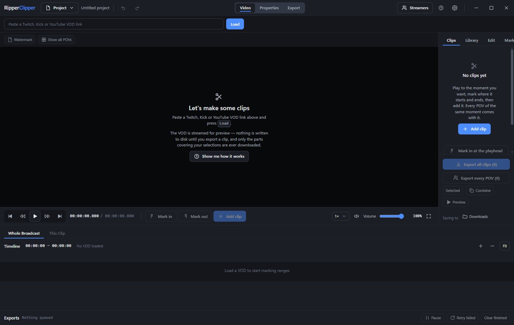

# Ripper Clipper 🍪

Cut the same moment out of several streamers' VODs at once — Twitch, Kick and YouTube.

One person's stream shows you the moment. Everyone else who was live was filming it too, from
their own angle. Ripper Clipper lines those recordings up on one real-world clock, so you mark
the moment **once** and get it from every angle.

Nothing is downloaded in full. Only the seconds you actually clip.



---

## Install

Download the installer from the [latest release](https://github.com/Omega248/RipperClipper/releases/latest)
and run it.

- Windows, no admin rights needed.
- The build is unsigned, so SmartScreen warns on first run — click **More info** → **Run anyway**.
- FFmpeg and yt-dlp come bundled. Nothing to install by hand.

It updates itself: when a new version is out you get a prompt, and it downloads only when you say so.

---

## Using it

**1. Add a VOD.** Paste a Twitch, Kick or YouTube link. It starts playing straight away.

**2. Add the other angles.** *Who else was live* finds streamers who were broadcasting at the same
time and adds them as extra POVs. They line up automatically.

**3. Mark the moment.** Play to it, press `I` where it starts and `O` where it ends, then `Enter`.

**4. Export.** Pick which angles you want and go. Files land in your chosen folder.

That's the whole loop. Everything else is optional.

### Where things are

| | |
|---|---|
| **Backlog** | Moments waiting to be worked on |
| **Events** | Your projects |
| **Streamers** | People you follow, and who's live now |
| **VODs & live** | Broadcasts you've loaded |
| **Watch** | The player — where you actually clip |
| **Clips** | Everything you've marked |
| **Export** | The render queue |

### Keys worth knowing

| Key | Does |
|-----|------|
| `Space` | play / pause |
| `←` `→` | seek 5s (hold `Shift` for 30s) |
| `I` `O` | start / end of the clip |
| `Enter` | make the clip |
| `M` | drop a marker |
| `F` | find this exact moment in every angle |
| `J` `L` | previous / next clip |
| `Ctrl+Z` | undo |

All of them can be changed in **Settings → Keyboard**.

---

## Good to know

**Adding an angle later works.** Load someone's VOD next week and it backfills into every clip it
covers. Nothing gets recreated.

**Every angle stays separate.** Its own trim, its own audio edits, its own watermark. Fixing one
doesn't touch the others.

**Your projects are safe.** Saves are atomic, there's an autosave recovery on next launch, and
**Project → Version history** keeps the last 10 saves with one-click restore.

**Watermarks** are per-streamer with a per-VOD override, placed by dragging on the picture, and
applied only when a file is written.

---

## Building it yourself

```bash
npm ci
npm run tools
npm start
```

To build the Windows installer:

```bash
npm run package:win
```

`npm run tools` downloads FFmpeg and yt-dlp from their publishers, checks each against the
publisher's own checksum, and runs them to prove they work.

Other commands: `npm run dev` (hot reload), `npm test`, `npm run typecheck`.

---

## If something goes wrong

| Problem | Try |
|---------|-----|
| A VOD won't load | Check it plays in a browser. Subscriber-only and deleted VODs can't be read. |
| Angles are out of sync | **Align by sound** on the POV, or nudge it a frame at a time in the Sync panel. |
| An export failed | The queue says why. **Retry failed** re-runs just those. |
| It says setup isn't finished | **Settings → Setup** shows what's missing and fetches it. |

**Settings → Diagnostics** has the technical detail — tool versions, paths and logs — for anything
not covered here.
